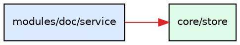

# deps-graph · 源码依赖图（import 关系扫描与可视化）

> 加载时机：用户要「画依赖图 / 看模块耦合 / 谁依赖谁 / 架构可视化 / 导出 graphviz 文件」，
> 或 agent 需要回答「改这个文件会影响谁」时。
> 一句话：`nx-rp deps` 扫 `src/` 的 import 关系（词法清洗后匹配），
> 输出 DOT 文本；面板「依赖图」tab 双模式（预览 / 编辑 DOT），
> Graphviz 官方 WASM 渲染，分层着色，跨层边红色；.dot 可另存/导入。
> **图是只读的**——从源码推导，改图 = 改代码。

---

## 一、它是什么

从源码 import 语句推导的**有向依赖图**：节点 = 文件（点分 id，如 `core.store`），
边 = 文件间的相对 import（裸包名 react / node:fs 不进图）。

| 输出形态 | 命令 | 用途 |
| --- | --- | --- |
| DOT 文本 | `nx-rp deps` | 给 graphviz / 直接阅读 / 粘给 agent |
| 结构化 JSON | `nx-rp deps --json` | `{dot, nodes, edges, stats}` 程序消费 |
| 面板可视化 | 面板「依赖图」tab | 分层着色、缩放浏览 |

**面板等价**：双模式画布——
- **预览**（默认）：扫描结果由 Graphviz 官方 WASM（@viz-js/viz）渲染 SVG，
  分层着色（core 绿 / modules 蓝 / runtime 橙 / web 紫 / 其它灰），
  跨层边红色（分层违例信号），同层边灰；缩放 25-400%
- **编辑**：textarea 看/改 DOT 文本，浏览器本地实时渲染（零网络往返）；
  语法错误结构化显示、旧图降透明保留。**编辑的是 DOT 文本草稿**——
  另存为 .dot 文件用，不回写源码图（图的事实源永远是源码 import）

---

## 二、扫描的准确性边界

依赖图的全部价值在**准确**。三条硬规则：

### 2.1 词法清洗后匹配（假边免疫）

扫描前先做词法清洗：剥注释与「非 import 说明符位置」的字符串，
再匹配 import。所以下面这些**都不是边**：

```js
// import { x } from './comment-only.js';      ← 注释
/* import { y } from './block-comment.js'; */  ← 块注释
const s = "import { z } from './in-string.js';";  ← 字符串
const t = `import { w } from './in-template.js'`; // 模板串
```

文本示例、文档引用、正则字面量里的 import 都不会误判成依赖。
（清洗器识别「说明符位置」：字符串前文是 `import…from` / `export…from` /
`import(` / `require(` 时保留内容，其余剥掉。）

### 2.2 JS 家族全覆盖

`.js` / `.mjs` / `.cjs` / `.jsx` 同等参与扫描。只扫 `.js` 会把整个
web 层（`App.jsx`、各模块 `view.jsx`）从图里漏掉——serve → web 的
依赖链直接断掉。

### 2.3 动态 import 也算边

`await import('./lazy.js')` 出现在表达式任意位置都能识别
（静态 import / export-from 锚定行首，动态 import 全文匹配）。

### 2.4 解析顺序（相对路径 → 文件）

`./x` 依次尝试：原样（已带扩展名）→ 补 `.js` → 目录 `index.js`。
原样优先——`./paths.js` 若先拼扩展名会变成 `paths.js.js` 永远 miss。

### 2.5 不进图的东西

- **裸包名**（`react`、`@xyflow/react`）与 **node 内置**（`node:fs`）——
  它们不是项目内文件
- **构建产物**（`public/`、`dist/`）与运行时数据目录——扫进来是噪声
- 节点 id = 相对扫描根的路径点分化（`core/store.js` → `core.store`），
  **目录导入落到真实文件**（`./pkg` → `pkg.index`）

---

## 三、CLI

```bash
nx-rp deps                  # DOT 文本输出到 stdout + 一行统计
nx-rp deps --json           # {dot, nodes, edges, stats}（stats: files/edges/crossLayer）
nx-rp deps --root ./lib     # 指定扫描根（默认 ./src；相对激活 scope 解析）
nx-rp deps save --file deps.dot          # 扫描结果落盘为 .dot（graphviz 交接）
nx-rp deps save --file d.dot --dot '...' # 显式给 DOT 文本保存（.dot/.gv 扩展名强制）
nx-rp deps load --file any/path.dot      # 读外部 .dot 文本（绝对路径可读，200K 上限）
```

**agent 典型问法**：

- 「改 core/store.js 会影响谁」→ `nx-rp deps --json` → 过滤 `edges` 里 `to === 'core.store'`
- 「哪些模块跨层依赖了」→ 看 `stats.crossLayer` + DOT 里 `color="#dc2626"` 的边
- 「web 层有哪些文件」→ 过滤 `nodes` 里 `id.startsWith('web.')`

---

## 四、DOT 输出约定



- 节点 id **带引号**（点分 id 含 `.`，引号形式是合法 DOT，graphviz 原生支持）
- `label` 用斜杠路径（`modules/doc/service`），人读友好
- 层判定 = id 首段（`core.` / `modules.` / `runtime.` / `web.`）

面板用 Graphviz 官方 WASM（@viz-js/viz）渲染这个 DOT——引擎即 `dot`
（还可用 neato/fdp/circo/twopi，编辑模式手写 DOT 时引擎按 graphviz 默认）。
导出的 .dot 文件可直接喂本地 graphviz 命令行（`dot -Tsvg deps.dot -o deps.svg`），
两边渲染结果一致（同一布局引擎）。

**XSS 边界（已知接受）**：DOT 的 html-like label（`label=<...>`）会原样进 SVG，
面板经 innerHTML 注入渲染。威胁模型=本地面板、内容作者=本机用户本人
（导入恶意 .dot ≈ 把恶意文件喂给本地 `graphviz -Tsvg`，同等信任级）。

---

## 五、常见错误

| 错误 | 后果 | 正确做法 |
| --- | --- | --- |
| 把编辑模式当成「改图」 | 编辑器里改的是 **DOT 文本草稿**（预览/另存用），不回写源码图 | 改依赖 = 改源码的 import，图会跟着变；编辑器用于手绘草图、外部图导入预览 |
| 用图当唯一事实源做架构决策 | 图是**推导视图**，源码才是事实 | 结合源码确认；图用于回答「谁依赖谁」 |
| 拿 `deps --json` 的 `dot` 字段自己正则解析 | 引号 id、属性块都容易解析错 | 用 `nodes` / `edges` 字段（结构化好的） |
| 期待循环依赖报错 | 当前不做环检测（只推导不评判） | 看图里成环的边自行判断 |
| 扫描根给错（`--root .` 扫到 node_modules） | 图巨大且全是噪声 | 默认 `./src` 就好；`node_modules`/`dist`/`public` 自动跳过 |
| `deps save` 给绝对路径或非 .dot/.gv 扩展名 | 直接拒绝（防误覆盖任意文件） | 用 cwd 相对路径 + .dot/.gv 扩展名 |

---

## 六、边界（不变量）

- **scan 只读**：图从源码 import 推导，无任何写回源码的路径；
  save/load 是 **DOT 文本**的落盘与读回（面向 graphviz 交接），不管理图实例
- **无 CRUD**：没有列表/命名/删除多实例——deps 不是 workflow，
  不要找「保存为名为 x 的图」这类入口；落盘就是普通 .dot 文件
- **不执行**：依赖图是静态分析，不跑任何被扫描的代码
- **cwd 隔离**：扫描根与 save 落盘基准都按激活 scope（cwdDir）解析，多项目互不干扰
